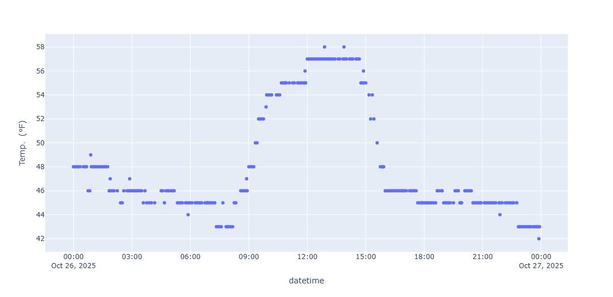

## Windspeed and Direction Visualization 
Using data from the Walla Walla Airport weather station, we will create a radial bar graph of windspeed and direction.

### Steps in Creating the Visualization
1. Scrape weather data from the [Walla Walla Airport NWS page](https://www.weather.gov/wrh/timeseries?site=KALW).
1. Import into this [colab worksheet](https://colab.research.google.com/drive/11yl4TzDl3MN-dlVS09SljJnpflDeRrhQ?usp=sharing).
1. Build visualization

#### Temperature Data

